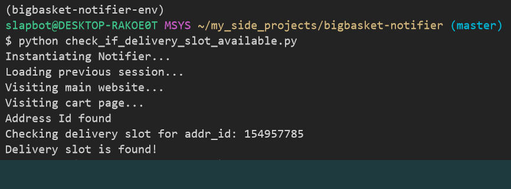

# BigBasket Notifier

A python program written to notify you whenever a delivery slot becomes available to your address in [BigBasket](https://www.bigbasket.com/).

- [Motivation](#motivation)
- [Features](#features)
- [Installation](#installation)
    - [Pre-Requisites](#pre-requisites)
    - [Application Setup](#application-setup)
    - [Authentication Setup](#authentication-setup)
- [Usage](#usage)
- [Applications](#applications)
- [TODO](#todo)

## Motivation

- Due to current pandemic crisis of Covid-19: A severe lockdown has been placed in India such that people look towards online services
to get their groceries to them, BigBasket is one of the popular services providing all of the resources online.

- However, due to the excess demand, delivery slots get filled way too quickly for anyone to order items for their given address.
This program helps you to notify whenever a slot becomes available to order your groceries online.

## Features

- Cross platform system wide notifications.
- You can login via OTP all by the terminal itself.
- Ability to save your sessions allowing you to login only once.
- Logging enabled by default for better debugging.
- Configuration flexibility regarding various options.
- Program doesn't do any javascript-rendering via headless browsers or anything.
- Polling is done via API endpoints rather than relying on scraping improving stability.

## Installation

### Pre-requisites

- python3.6+
- pip
- virtualenv

### Application Setup

1. Clone the repo: `git clone https://github.com/wrap-away/bigbasket-notifier`
2. Cd into the directory: `cd bigbasket-notifier`
3. Create a virtualenv for python: 
    - Linux: `python -m venv bigbasket-notifier-env`
    - Windows: `virtualenv bigbasket-notifier-env`
4. Activate the virtualenv:
    - Linux: `source bigbasket-notifier-env/bin/activate`
    - Windows: `source bigbasket-notifier-env/Scripts/activate`
5. Upgrade your pip to latest version: `pip install --upgrade pip`
6. Install the application dependencies: `pip install -r requirements.txt`

### Authentication Setup

1. fill in your `phone_number` in `config.ini` file under APP section.
2. Change `interval` in `config.ini` file to the interval minutes in which you want to check for delivery slot.
    - Default: 10 minutes - such that after every 10 minutes BigBasket will be polled to check if delivery slot has become available.

## Usage

1. Login to BigBasket by using: `python login.py`
    - It will ask for OTP where you could give it via terminal.
2. Start checking for delivery spots using: `python check_if_delivery_slot_available.py`
    - As soon as a delivery slot is found, your OS will be pinged with a system notification to let you know about it.
    - Logs at `app.log` will also write an entry regarding it as well.

## Application

- Integrate the package to a Web UI to help create notifiers.
- Integrate via any of the messaging channel such as slack, telegram to create notifiers.
- Build on top of the package to create more powerful features.

## Todo

- [x] Create a more robust CLI component.
- [x] Schedule checking for delivery slots. (can use cronjob but would prefer a native library)
- [ ] Create endpoint automation of address switching in an account.
- [ ] Create a pip package for better accessibility towards developers integrating it with other notification channels.
- [ ] Build a wrapper using the underlying technology to create a country-wide delivery slots notifier per city.
